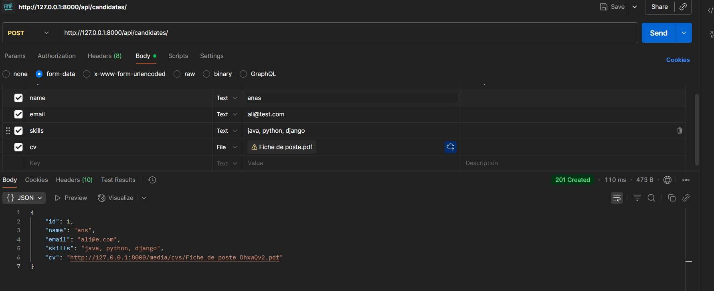
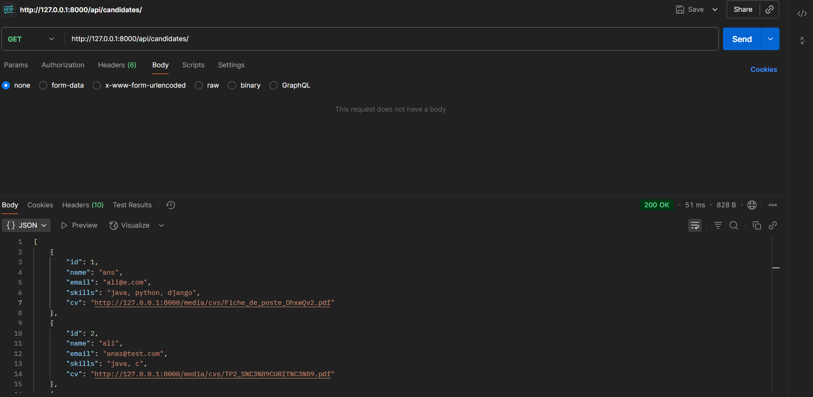
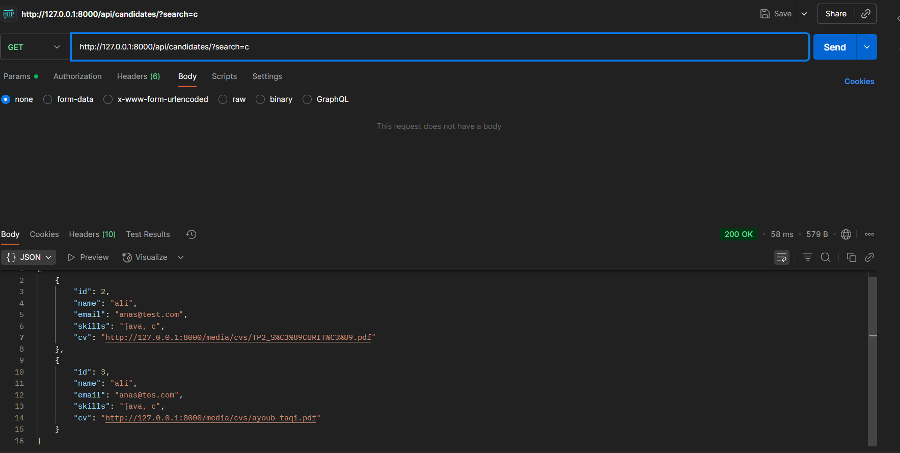

# 🎯 Gestion des Candidats - Application Full Stack

Une application **end-to-end** moderne pour la gestion des candidats avec une architecture complète.

## 🏗️ Architecture du Projet

Cette application est composée de :

- **🔧 Backend (API)** : Django + Django REST Framework
- **🎨 Frontend** : Application web moderne en HTML/TypeScript
- **💾 Base de données** : PostgreSQL
- **🐳 Orchestration** : Docker & Docker Compose

---

## 📋 Prérequis

Avant de commencer, assurez-vous d'avoir installé :

- [Docker Desktop](https://www.docker.com/products/docker-desktop/)
- Python 3.8+
- pip3

---

## 🚀 Installation et Démarrage

### 1. Préparation du projet

```bash
# Télécharger et extraire le fichier ZIP du projet
# Naviguer dans le dossier du projet
cd mini_projet
```

### 2. Installation des dépendances

```bash
# Installer les dépendances Python
pip3 install -r requirements.txt
```

### 3. Démarrage des services avec Docker

```bash
# Construire et démarrer les conteneurs
docker-compose up --build -d
```

Cette commande démarre :
- **db** : Conteneur PostgreSQL pour la base de données

### 4. Configuration de la base de données

```bash
# Naviguer dans le dossier backend
cd backend

# Appliquer les migrations Django
python manage.py migrate

# Démarrer le serveur de développement
python manage.py runserver
```

### 5. Accès à l'application

🌐 **URL d'accès** : [http://127.0.0.1:8000/](http://127.0.0.1:8000/)

---

## 📡 Documentation API

L'API REST offre plusieurs endpoints pour gérer les candidats :

### 1. 📝 Créer un nouveau candidat



### 2. 📋 Lister tous les candidats



Retourne la liste complète des candidats enregistrés avec leurs informations détaillées.

### 3. 🔍 Filtrer les candidats par compétences



Permet de rechercher des candidats possédant des compétences spécifiques.

---

## ⚙️ Fonctionnalités supplémentaires possibles

Cette application peut être enrichie avec d'autres fonctionnalités, par exemple :

### 🔒 Sécurisation des API
- Authentification par token ou JWT pour protéger les endpoints
- Gestion des rôles et permissions pour différents types d’utilisateurs
- Limitation du nombre de requêtes (rate limiting)

### 📊 Statistiques et rapports
- Suivi des candidatures et des compétences

### ✉️ Notifications par email
- Informer les candidats ou l’équipe RH

> Ces fonctionnalités peuvent être intégrées progressivement pour rendre l'application plus complète et sécurisée.

---

*Projet développé pour la gestion moderne des candidats*
